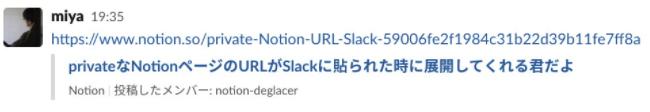

deglacer
=======

[][license]
[][godoc]

[actions]: https://github.com/MH4GF/notion-deglacer/actions?workflow=test
[license]: https://github.com/MH4GF/notion-deglacer/blob/master/LICENSE
[godoc]: https://godoc.org/github.com/MH4GF/notion-deglacer

NotionリンクをSlack上で展開してくれる君

## Description

notion-deglacerはprivateなNotionリンクがSlackに投稿された際に、それを展開してくれるSlack Appです。以下の機能を備えています。

- Notionの記事タイトル展開
  
## Installation

1. Notion APIのIntegrationsをInternal integrationsで作成し、tokenを取得
2. Slack App作成
3. notion-deglacerのデプロイ
4. 2で作ったappに、3のURLを登録する
5. Slack Appのbotユーザーをチャンネルに招待する
6. 展開したいページでIntegrationを許可する

### 1. Notion APIのIntegrationsをInternal integrationsで作成し、tokenを取得

1. https://www.notion.so/my-integrations の New integration からインテグレーションを作成
2. Basic Informationを記入し、Submit
    - Name, Associated workspaceを指定
    - Content Capabilities は Read content にチェック
    - User Capabilities は No user information
3. Internal Integration Token をクリップボードにコピー（`NOTION_TOKEN`）

### 2. Slack Appの作成

1. https://api.slack.com/apps の Create New App からアプリ作成
2. 左メニュー OAuth & Permissions を開き、Scopesでlink:writeを追加
3. 左メニュー Event Subscriptions を開き、Enable EventsをOnに変更
    - App unfurl domains を展開し、 Add Domain で、 `www.notion.so` を入力し、Save Changes
4. 左メニュー Install App を開き、 Install App to Workspace -> Allow
5. OAuth Access Token が表示されるのでクリップボードにコピー (`SLACK_TOKEN`)
6. Basic Information を開き App CredentialsのSigning Secretをクリップボードにコピー (`SLACK_SIGNING_SECRET`)

※後で戻ってくるので、Slack Appの管理画面は開いたままにしておく。

### 3. deglacerのデプロイ

deglacerはGoで書かれたWebアプリケーションなので、任意の場所で簡単に動かせますが、render.comやGoogle App Engineを利用するのがより簡単でしょう。動作のためには以下の環境変数が必要です。

- `NOTION_TOKEN`: 手順1で取得したNotionのアクセストークン
- `SLACK_TOKEN`: 手順2-5で取得したSlack Appのトークン
- `SLACK_SIGNING_SECRET`: 手順2-6で取得したリクエスト署名検証secret

#### renderで動かす場合

以下のボタンからデプロイできます。

### 4. 2で作ったappに、3のURLを登録する

- 左メニュー Event Subscriptions を開き、 Request URL に 3でデプロイしたdeglacerのURLを入力
- Verified と表示されたら Enable Events を On にして Save Changes

### 5. Slack Appのbotをチャンネルに招待する

Bot名は、左メニューのApp Homeから確認してください。

### 6. 展開したいページでIntegrationを許可する 

API経由でのアクセスをするためには、そのページでIntegrationを許可する必要があります。  

現状ワークスペースレベルで全てのページを許可することはできないようです。  
とはいえ親ページで許可をすれば子孫のページでも適用されるため、サイドバーの各ページで許可をすれば面倒ですが解決は可能です。  

これで準備完了です。

## See Also

notion-deglacerは[Songmu](https://github.com/Songmu)さんのリポジトリをフォークして作られています。    
[https://github.com/Songmu/deglacer](https://github.com/Songmu/deglacer)  
Webサーバーの処理、Slackへの送信処理の大半をそのまま利用させていただいています。この場をお借りして御礼申し上げます。ありがとうございました！

## Author

[miya](https://github.com/MH4GF)
